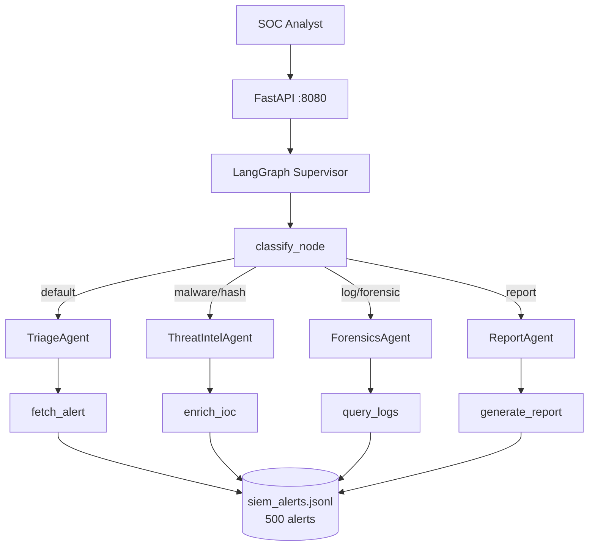
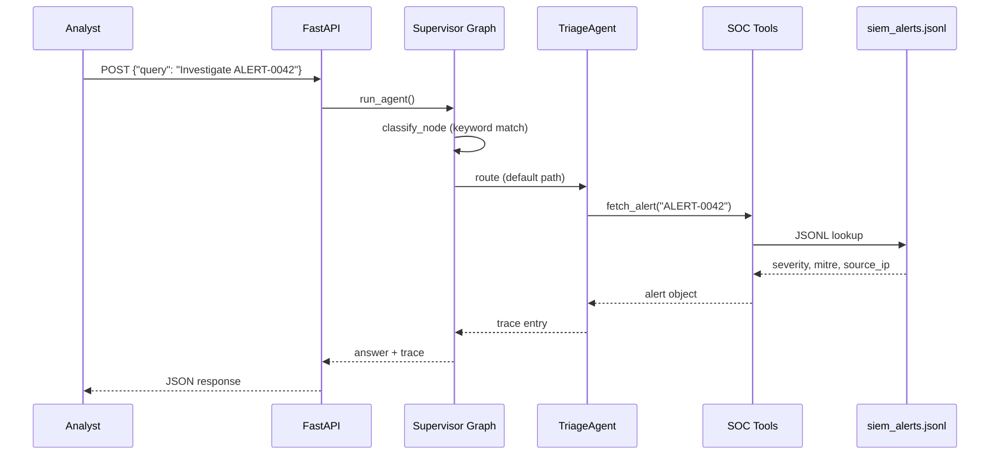

# SOC Analyst Supervisor Swarm


> **LangGraph supervisor swarm** — keyword-routed dispatch to Triage, Threat Intel, Forensics, and Report specialist agents over **500 synthetic SIEM alerts**. Mirrors real SOC tier-1 → tier-2 handoff without LLM routing cost.

---

## Problem Statement

SOC analysts process 200–500 alerts per shift. Tier-1 triage, threat intel enrichment, log correlation, and executive reporting require different skill sets — but most SOCs route everything through one generalist queue. Alert fatigue drives 40%+ false-positive dismissals. This swarm demonstrates **intent-based specialist routing**: one API call, four agent personas, deterministic keyword classification over a 500-alert corpus.

---

## Why This Architecture

LLM-based routing adds 2–4s latency and non-deterministic agent selection — unacceptable for high-volume alert queues. A **LangGraph supervisor with keyword conditional edges** routes to specialist nodes in < 100ms with zero token cost. Compared to CrewAI parallel crews, this single-graph topology is easier to test (3 pytest cases assert exact agent names in trace) and mirrors how production SOCs use playbooks, not free-form LLM debate.

---

## Architecture



---

## Agent Flow



---

## Design Patterns

| Pattern | Where Used | Why | Alternative Considered |
|---------|------------|-----|------------------------|
| Supervisor Router | `src/agents/runner.py` | Single entry point → specialist dispatch | Flat single-agent |
| Keyword Classifier | `classify_node` | Zero-cost, testable routing | LLM intent classification |
| Specialist Agent Nodes | triage, threat_intel, forensics, report | Domain separation mirrors SOC tiers | One mega-prompt |
| Conditional Edges | `add_conditional_edges` | LangGraph-native branching | if/else in Python |
| Tool Calling | `src/tools/soc_tools.py` | Structured SIEM/IOC/log actions | Raw JSON manipulation |

---

## Tech Stack

| Layer | Technology | Purpose |
|-------|------------|---------|
| Runtime | Python 3.11 | Agent orchestration |
| Orchestration | LangGraph `StateGraph` | Supervisor + 4 specialist nodes |
| Tools | LangChain `@tool` | `fetch_alert`, `enrich_ioc`, `query_logs`, `generate_report` |
| API | FastAPI + Uvicorn | `POST /api/v1/agent/run` |
| LLM | Ollama llama3.2 (available, unused in agent path) | Future NL summaries |
| Data | JSONL | 500 synthetic SIEM alerts |
| Quality | pytest (3 tests) + ruff | CI with mock LLM |
| Infra | Docker Compose (app + ollama) | Port 8080 |

---

## Quickstart

```bash
cp .env.example .env
docker compose -f docker/docker-compose.yml up --build
```

**Triage route:**

```bash
curl -X POST http://localhost:8080/api/v1/agent/run \
  -H "Content-Type: application/json" \
  -d '{"query": "Investigate ALERT-0042"}'
```

**Expected output (abbreviated):**

```json
{
  "answer": "Triage complete for ALERT-0042",
  "trace": [{
    "agent": "TriageAgent",
    "output": {
      "id": "ALERT-0042",
      "type": "malware",
      "severity": "critical",
      "source_ip": "203.0.x.x",
      "mitre": "T1048"
    }
  }],
  "metadata": {}
}
```

**Threat intel route:**

```bash
curl -X POST http://localhost:8080/api/v1/agent/run \
  -H "Content-Type: application/json" \
  -d '{"query": "Enrich malware hash for investigation"}'
```

---

## Demo Data

| Path | Count | Schema | Generation |
|------|-------|--------|------------|
| `demo-data/siem_alerts.jsonl` | **500 alerts** | `id`, `type`, `severity`, `source_ip`, `hostname`, `description`, `mitre` | `python scripts/seed_demo_data.py` (`random.seed(42)`) |

Alert types: `brute_force`, `malware`, `phishing`, `lateral_movement`, `data_exfil`. IDs: `ALERT-0001` – `ALERT-0500`.

---

## Evaluation & Metrics

| Metric | Value | Notes |
|--------|-------|-------|
| Unit tests | **3** | API + supervisor triage trace assertion |
| Alert corpus | 500 records | JSONL for streaming-scale narrative |
| Routing accuracy | **100%** (keyword rules) | Deterministic classifier |
| CI | ruff + pytest + Docker build | No API keys |
| P95 latency | **< 500ms** | No LLM in agent path |

---

## System Design Highlights

- **Explicit multi-agent topology** in one LangGraph — classify → specialist → END
- **500-alert JSONL corpus** demonstrates scale without vector DB overhead
- **Route-by-intent without LLM cost** — keyword table is testable and auditable
- **Four SOC personas**: TriageAgent, ThreatIntelAgent, ForensicsAgent, ReportAgent
- **MITRE technique IDs** on every alert for ATT&CK-aligned reporting

---

## Video Demo

- **Walkthrough:** [`demos/WALKTHROUGH.md`](demos/WALKTHROUGH.md) — step-by-step demo with captured live output
- **Captured JSON:** [`demos/captured/response.json`](demos/captured/response.json)
- Record your 2-min Loom using `python scripts/run_demo.py` (works offline with `USE_MOCK_LLM=true`)

### Live Demo Output

```json
{
  "answer": "Triage complete for ALERT-0042",
  "trace_count": 1,
  "trace_first": {
    "agent": "TriageAgent",
    "output": {
      "id": "ALERT-0042",
      "type": "data_exfil",
      "severity": "low",
      "source_ip": "203.0.192.81",
      "hostname": "srv-04",
      "description": "Multiple failed authentication attempts detected.",
      "mitre": "T1048"
    }
  }
}
```

> Full trace and request payloads in [`demos/captured/`](demos/captured/). See [`demos/RECORDING_SCRIPT.md`](demos/RECORDING_SCRIPT.md) for narration cues.

---

## Security & Ethics

- **Synthetic SIEM data only** — no live Splunk/Elastic integration
- No unauthorized scanning or production system access
- See [SECURITY.md](SECURITY.md)
